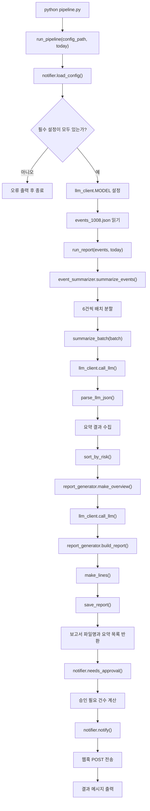

# Python 자동화 파이프라인 — 함수 실행 흐름

```mermaid
flowchart TD
    A["python pipeline.py"] --> B["run_pipeline(config_path, today)"]
    B --> C["notifier.load_config()"]
    C --> D{"필수 설정이 모두 있는가?"}
    D -- "아니오" --> X["오류 출력 후 종료"]
    D -- "예" --> E["llm_client.MODEL 설정"]
    E --> F["events_1008.json 읽기"]
    F --> G["run_report(events, today)"]
    G --> H["event_summarizer.summarize_events()"]
    H --> I["6건씩 배치 분할"]
    I --> J["summarize_batch(batch)"]
    J --> K["llm_client.call_llm()"]
    K --> L["parse_llm_json()"]
    L --> M["요약 결과 수집"]
    M --> N["sort_by_risk()"]
    N --> O["report_generator.make_overview()"]
    O --> P["llm_client.call_llm()"]
    P --> Q["report_generator.build_report()"]
    Q --> R["make_lines()"]
    R --> S["save_report()"]
    S --> T["보고서 파일명과 요약 목록 반환"]
    T --> U["notifier.needs_approval()"]
    U --> V["승인 필요 건수 계산"]
    V --> W["notifier.notify()"]
    W --> Y["웹훅 POST 전송"]
    Y --> Z["결과 메시지 출력"]
```
